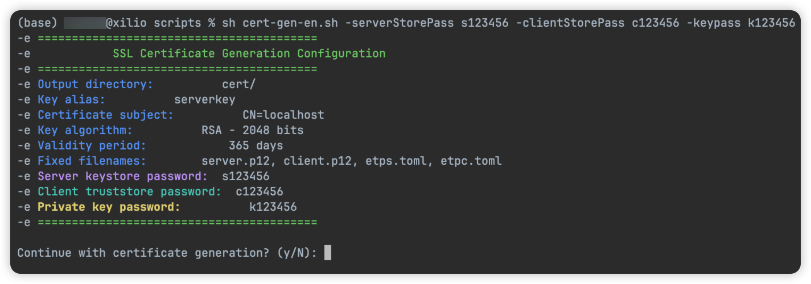

[](https://github.com/xiaoniucode/etp)
[](https://github.com/xiaoniucode/etp)
[](https://github.com/xiaoniucode/etp/issues)
[](https://github.com/xiaoniucode/etp/blob/main/LICENSE)
[](https://github.com/xiaoniucode/etp/commits)

[README](README.md) | [中文文档](README_ZH.md)

## ✨ Introduction
**etp** (Easy Tunnel Proxy) is a lightweight, high-performance tunnel proxy middleware that supports TCP, HTTP protocols, as well as upper-layer TCP protocols, and includes TLS 1.3 secure encryption. It is used to quickly expose internal network services as public network services, facilitating development and testing while reducing the cost of purchasing cloud servers.

## 🌟 Features
- 💻 Supports TCP, HTTP, HTTPS and other protocols
- 🔐 Uses TLS 1.3 for efficient and secure encryption
- 🛜 High-performance data transmission
- 🚀 Millisecond-level startup
- 🐒 Supports multiple clients
- 💨 Lightweight with low resource usage

## 🚀 Quick Start
Download the corresponding [release version](https://github.com/xiaoniucode/etp/releases) installation package based on your operating system. The server is generally deployed on a server with a public IP.

### 🖥️ Server
This demonstrates how to expose an internal MySQL service to the public port 3307.

> Edit the configuration file `etps.toml` and add the following content

```toml 
bindPort=9527
[[clients]]
name = "Mac" #Client name
secretKey = "4b0063baa5ae47c2910fc25265aae4b9" #[Required] 32-bit secret key, please customize, do not use this one

[[clients.proxies]]
name = "mysql" #Custom name
type = "tcp" #Network transmission protocol
localPort = 3306 #Internal service port
remotePort = 3307 #Public service port

#[[clients.proxies]]
#name = "redis"
#type = "tcp"
#localPort = 6379
#remotePort = 6380
```

Start the etp server on a Linux server. For external access, it needs to be deployed on a server with a public IP.

```shell
nohup ./etps -c etps.toml &
```

### 💻 Client etpc Configuration

> Edit the configuration file `etpc.toml`

```toml
serverAddr = "127.0.0.1" #Server address where etps is deployed
serverPort=9527 #Server's bindPort
secretKey="4b0063baa5ae47c2910fc25265aae4b9" #Consistent with server configuration
```

Start the client on the internal network computer, using Mac as an example

```shell
nohup ./etpc -c etpc.toml &
```

After successful startup, use the **3307** port to connect to MySQL

## 🔒 Configure SSL (Optional)
> Versions of etp after v1.0.2 have added TLS 1.3-based secure encryption functionality, which can be configured as needed.

1️⃣ First, download the certificate generation command-line tool provided by the project [generate_ssl_cert-en.sh](scripts/generate_ssl_cert-en.sh) to your local machine (you can also use JDK's keytool directly). For detailed usage instructions, please refer to the [Certificate Generation Document](doc/code-gen.md). This tool currently depends on JDK, so ensure the runtime environment is available.

2️⃣ After downloading the script locally, execute the following command in the terminal to generate the certificate and key. If it's too troublesome, you can run it without any parameters, and the script will automatically generate complex keys.

```shell
sudo sh cert-gen.sh -serverStorePass s123456 -clientStorePass c123456 -keypass k123456
```

3️⃣ After executing the script, two important certificate files will be generated: **server.p12** needs to be deployed on the server, while **client.p12** is deployed on the client. The configuration information is in the corresponding toml files.


- Add the following content to the `etps.toml` configuration file

```properties
ssl = true
[keystore]
path = "server.p12" #Server certificate path
keyPass = "veHzlXBADiAr" #Private key
storePass = "veHzlXBADiAr" #Server keystore password
```

- Add the following content to the `etpc.toml` configuration file

```properties
ssl = true
[truststore]
path = "client.p12" #Certificate path
storePass = "JCAkB4X7G3T6" #Client truststore password
```

> ⚠️ If ssl is set to true, ensure both server and client are set to true, otherwise it will error!

For specific details, please view the [Certificate Configuration Document](doc/code-gen.md)!
## Issue Reporting
Report issues: [issues](https://github.com/xiaoniucode/etp/issues)
## 📈 Project Trends
<p align="center">
  <a href="https://github.com/xiaoniucode/etp/stargazers">
    
  </a>
</p>
