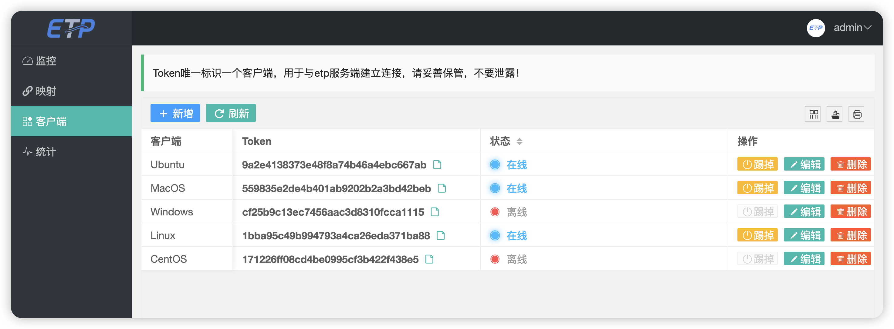
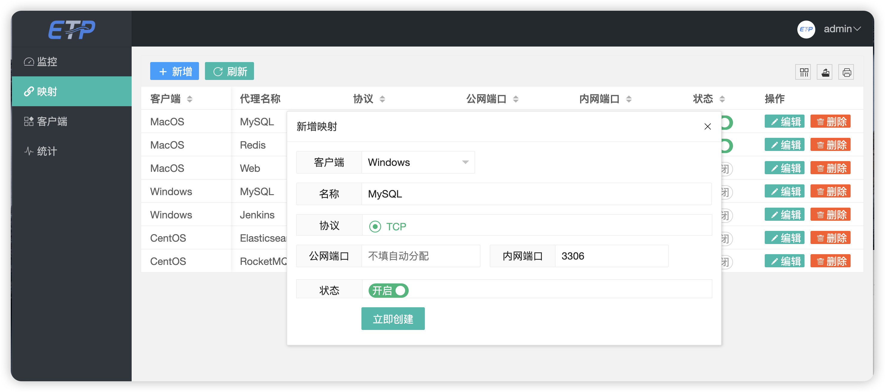
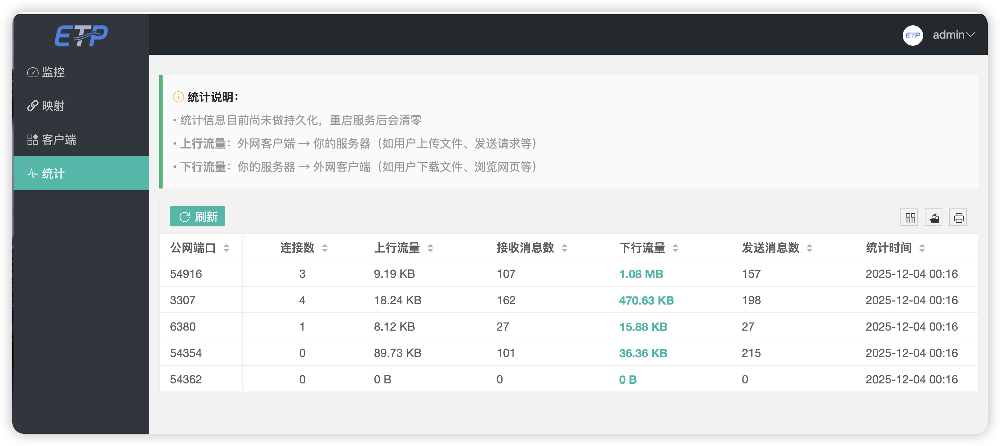

<div align="center">
  
</div>
<div align="center" style="font-size:18px;color:#555;margin-top:-10px;margin-bottom:24px;">
A lightweight NAT traversal reverse proxy application implemented with Netty.
</div>
<div align="center">
  <a href="https://github.com/xiaoniucode/etp">
    
  </a>
  <a href="https://github.com/xiaoniucode/etp">
    
  </a>
  <a href="https://github.com/xiaoniucode/etp/issues">
    
  </a>
  <a href="https://github.com/xiaoniucode/etp/blob/main/LICENSE">
    
  </a>
  <a href="https://github.com/xiaoniucode/etp/releases/tag/0.2.0">
    
  </a>
<a href="https://github.com/xiaoniucode/etp/releases">
  
</a>
</div>

<div align="center">
  <a href="README.md"><strong>README</strong></a> &nbsp;|&nbsp;
  <a href="README_ZH.md"><strong>中文文档</strong></a> &nbsp;|&nbsp;
  <a href="https://xiaoniucode.github.io/etp"><strong>Documentation</strong></a>
</div>

## ✨ Introduction

**etp** (Easy Tunnel Proxy) is a lightweight, high-performance reverse proxy application for NAT traversal. It supports TCP, HTTP and upper-layer TCP protocols, as well as efficient and secure TLS 1.3 encryption. Both pure Toml static configuration and dynamic configuration via management interface are supported. etp enables rapid exposure of internal network services to the public internet, making them accessible for public users and development/testing purposes, while reducing the cost of purchasing public cloud servers.

## 🌟 Features

- 📡 Supports TCP and HTTP protocols
- 🔐 Utilizes efficient and secure TLS 1.3 encryption
- 🖥️ Intuitive management UI for configuration
- 🛜 High-performance, low-latency data transfer
- 🚀 Millisecond-level startup
- 🔗 Automatic reconnection
- 🔐 Authentication
- 🐒 Supports multiple clients
- 🧿 Automatic port allocation for mapping
- 📄 Supports pure Toml configuration and web UI configuration
- 📺 Cross-platform, compatible with arm64 and amd64 architectures
- 💨 Lightweight with low resource consumption

## 🎨 Dashboard Screenshots

In addition to supporting pure Toml static configuration, etp also provides a graphical management interface for easy operation. This greatly reduces management and usage costs while offering more comprehensive features.

<div align="center">
  <table width="100%">
    <tr>
      <td align="center" width="50%" style="vertical-align:top;">
        <br/>
        <sub>Login Page</sub>
      </td>
      <td align="center" width="50%" style="vertical-align:top;">
        <br/>
        <sub>Monitoring Dashboard</sub>
      </td>
    </tr>
    <tr>
      <td align="center" width="50%" style="vertical-align:top;">
        <br/>
        <sub>Client List</sub>
      </td>
      <td align="center" width="50%" style="vertical-align:top;">
        <br/>
        <sub>Add Mapping</sub>
      </td>
    </tr>
    <tr>
      <td align="center" width="50%" style="vertical-align:top;">
        <br/>
        <sub>Mapping List</sub>
      </td>
      <td align="center" width="50%" style="vertical-align:top;">
        <br/>
        <sub>Traffic Statistics</sub>
      </td>
    </tr>
  </table>
</div>

## 🚀 Quick Start

Download the appropriate [release package](https://github.com/xiaoniucode/etp/releases) for your operating system. The server is typically deployed on a machine with a public IP address.

### 🖥️ Server Setup

This section demonstrates how to expose an internal MySQL service to the public on port 3307.

> Edit the configuration file `etps.toml` and add the following content:

```toml
bindPort = 9527
[[clients]]
name = "Mac" # [Required] Custom client name
secretKey = "your client authentication key" # [Required] Custom key

[[clients.proxies]]
name = "mysql" # Service name
type = "tcp" # [Required] Network transport protocol
localPort = 3306 # [Required] Internal service port
remotePort = 3307 # [Optional] Public service port; if not specified, a port will be randomly assigned by the system
```

Start the etp server on a Linux server. For external access, make sure to deploy it on a machine with a public IP address.

```shell
nohup ./etps -c etps.toml &
```

### 💻 Client etpc Configuration

> Edit the configuration file `etpc.toml`:

```toml
serverAddr = "x.x.x.x" # IP address of the server where etps is deployed
serverPort = 9527 # bindPort port of the server
secretKey = "your client authentication key" # Must match the server configuration
```

Start the client on an internal computer (Unix example):

```shell
./etpc -c etpc.toml # Or run in the background: nohup ./etpc -c etpc.toml &
```

🔔 **Note**: If the configuration file and executable are in the same folder, you **do not need to use -c** to specify the configuration.

After a successful startup, connect to MySQL using port **3307**.

## 🔒 TLS Configuration (Optional)

1️⃣ First, download the certificate generation CLI tool [tls.sh](scripts/tls/tls.sh) from the project. Download the appropriate keytool version for your OS from [this directory](scripts/tls), remove the extension, and place it in the same directory as the `tls.sh` script.

After downloading the script locally, run the following command in the terminal to generate the certificate and key. The script will automatically generate the keys. (Linux example)

```shell
sudo sh tls.sh 
```


3️⃣ Upon execution, the script will generate two important certificate files: **server.p12** (for deployment on the server), and **client.p12** (for deployment on the client). Configuration details should be added to the respective toml files.


- Add the following content to the `etps.toml` server configuration file:

```properties
tls = true
[keystore]
path = "Path to your server certificate"
keyPass = "Your private key"
storePass = "Your keystore password"
```

- Add the following content to the `etpc.toml` client configuration file:

```properties
tls = true
[truststore]
path = "Path to your client certificate"
storePass = "Your client keystore password"
```

> ⚠️ If you set `tls` to `true`, you must ensure `tls` is set to `true` on both server and client; otherwise, errors will occur!

## Feedback

To report issues: [issues](https://github.com/xiaoniucode/etp/issues)

## 📈 Project Trends

<p align="center">
  <a href="https://github.com/xiaoniucode/etp/stargazers">
    
  </a>
</p>
