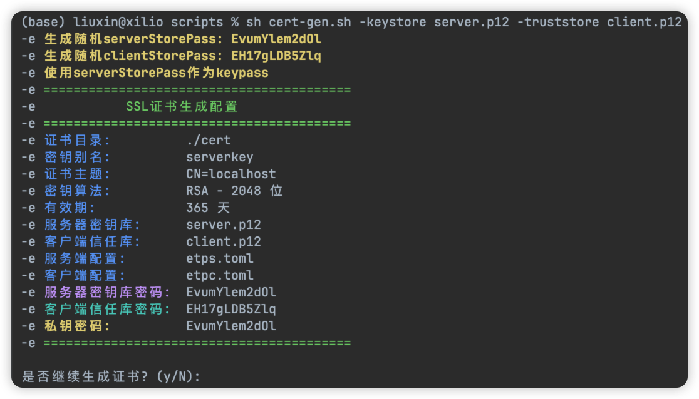

[](https://github.com/xiaoniucode/etp)
[](https://github.com/xiaoniucode/etp)
[](https://github.com/xiaoniucode/etp/issues)
[](https://github.com/xiaoniucode/etp/blob/main/LICENSE)
[](https://github.com/xiaoniucode/etp/commits)

[README](README.md) | [中文文档](README_ZH.md)

##  ✨ 介绍
**etp**（Easy Tunnel Proxy）是一个轻量级的高性能隧道代理中间件，支持TCP、HTTP协议以及TCP上层协议且支持TLS1.3安全加密。用于将内网服务快速暴露为公网服务，便于开发测试，减少购买云服务器成本。

📄[查看文档](https://xiaoniucode.github.io/etp)
## 🌟 功能特性
- 💻 支持TCP、HTTP/HTTPS等协议
- 🔐 采用TLS1.3高效安全加密协议
- 🛜 高性能数据传输
- 🚀 毫秒级启动
- 🔗 断线重连
- 🔐 身份认证
- 🐒 支持多客户端
- 🧿 自动分配映射端口
- 📺 跨平台且支持arm64和amd64架构
- 💨 轻量级，资源占用率低

## 🚀 快速开始
根据操作系统下载对应的[发行版本](https://github.com/xiaoniucode/etp/releases)安装包，服务端一般部署在具备公网IP的服务器上。

### 🖥️ 服务端
这里演示如何将内网的MySQL服务暴露到公网的3307端口上。

> 编辑配置文件 `etps.toml` 添加如下内容

```toml 
bindPort=9527
[[clients]]
name = "Mac" #客户端名称
secretKey = "你的客户端认证密钥" #[必填]自定义32位密钥

[[clients.proxies]]
name = "mysql" #[可选]服务名字
type = "tcp" #[必填]网络传输协议
localPort = 3306 #[必填]内网服务的端口
remotePort = 3307 #[可选]公网服务端口，如果不填系统会随机分配一个端口
```

在Linux服务器上启动etp服务端，若需要外部访问，需要部署在具备公网IP的服务器上。

```shell
nohup ./etps -c etps.toml &
```
### 💻 客户端etpc配置

> 编辑配置文件 `etpc.toml`

```toml
serverAddr = "x.x.x.x" #etps部署服务器IP地址
serverPort=9527 #服务端的bindPort端口
secretKey="你的客户端认证密钥" #和服务端配置保持一致
```

在内网电脑启动客户端，以unix操作系统为例

```shell
./etpc -c etpc.toml # 或后台运行：nohup ./etpc -c etpc.toml &  
```
🔔**备注**：如果配置文件和可执行程序在同一个文件夹可**不用用-c**指定配置。

启动成功后用 **3307** 端口去连接MySQL

## 🔒 配置TLS（可选）

1️⃣ 首先需要下载项目提供的证书生成命令行工具[generate_ssl_cert.sh](scripts/generate_ssl_cert.sh) 到本地（也可以直接使用jdk的keytool生成），该工具详细使用教程请参考[证书生成文档](doc/code-gen.md),该工具目前依赖jdk，需要保证有该运行环境。

2️⃣ 脚本下载本地后，在终端执行如下命令生成证书和密钥，如果嫌麻烦也可以不带任何参数，脚本会自动生成复杂的密钥。

```shell
sudo sh cert-gen.sh -serverStorePass s123456 -clientStorePass c123456 -keypass k123456
```



3️⃣ 脚本执行后会生成两个重要的证书文件，**server.p12** 需要部署到服务端，而 **client.p12** 部署在客户端，配置信息在对应的toml文件里。


- `etps.toml` 配置文件增加如下内容

```properties
tls = true
[keystore]
path = "你的服务端证书路径"
keyPass = "你的私钥"
storePass = "你的存储库密钥"
```

- `etpc.toml` 配置文件需要增加如下内容

```properties
tls = true
[truststore]
path = "你的客户端证书路径"
storePass = "你的客户端存储库密钥"
```

> ⚠️ 如果ssl设置为true，必须保证服务端和客户端都设置为true，否则会出错！

具体细节请查看[证书配置文档](doc/code-gen.md)！

## 问题反馈
反馈问题:[issues](https://github.com/xiaoniucode/etp/issues)

## 📈 项目趋势
<p align="center">
  <a href="https://github.com/xiaoniucode/etp/stargazers">
    
  </a>
</p>
