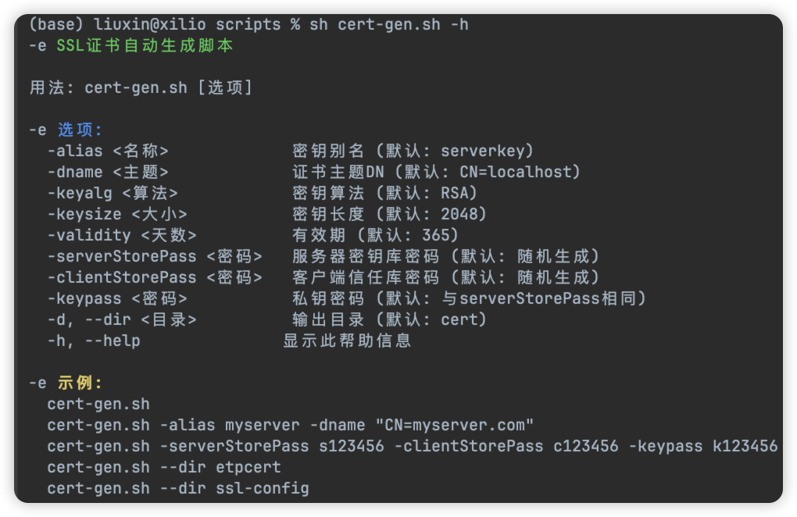
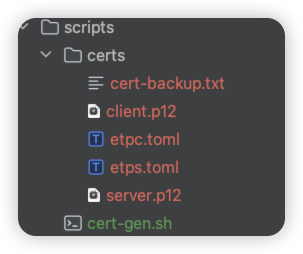
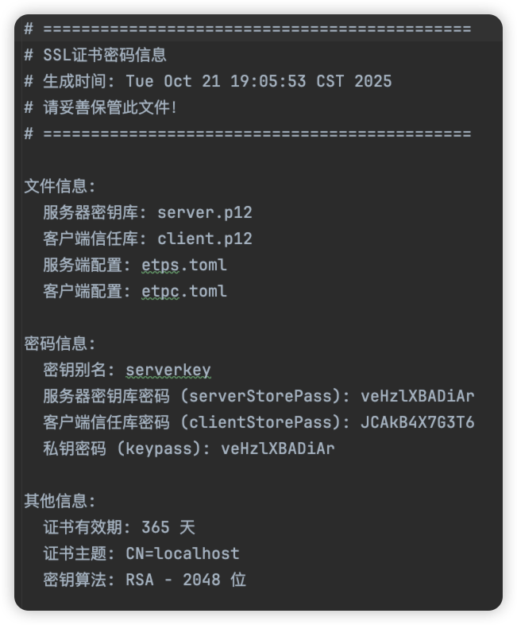
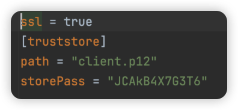

# 证书生成脚本
 [查看详细使用手册](generate_ssl_cert.md)
## 参看帮助信息

如果嫌麻烦可以直接执行命令，不需要任何参数，脚本飞会生成默认的配置。
```shell
sh cert-gen.sh
```

## 案例
1、执行命令
```shell
sh cert-gen.sh -serverStorePass s123456 -clientStorePass c123456 -keypass k123456
```
可以看到脚本自动生成了密码信息，输入y继续


此时证书和密钥已经生成并放到了cert文件夹下面。


结果如下图所示：



2、生成文件介绍

- cert.backup.txt :包含了所有证书保存地址和密钥信息

- client.p12 : 客户端证书，内网客户端使用⚠️
- server.p12 : 服务端证书，公网服务端使用⚠️
- etps.toml : 服务端配置，直接将配置信息复制到服务端配置文件里面，**注意path路径**

- etpc.toml : 客户端配置，直接将配置信息复制到客户端配置文件里面，**注意path路径**

