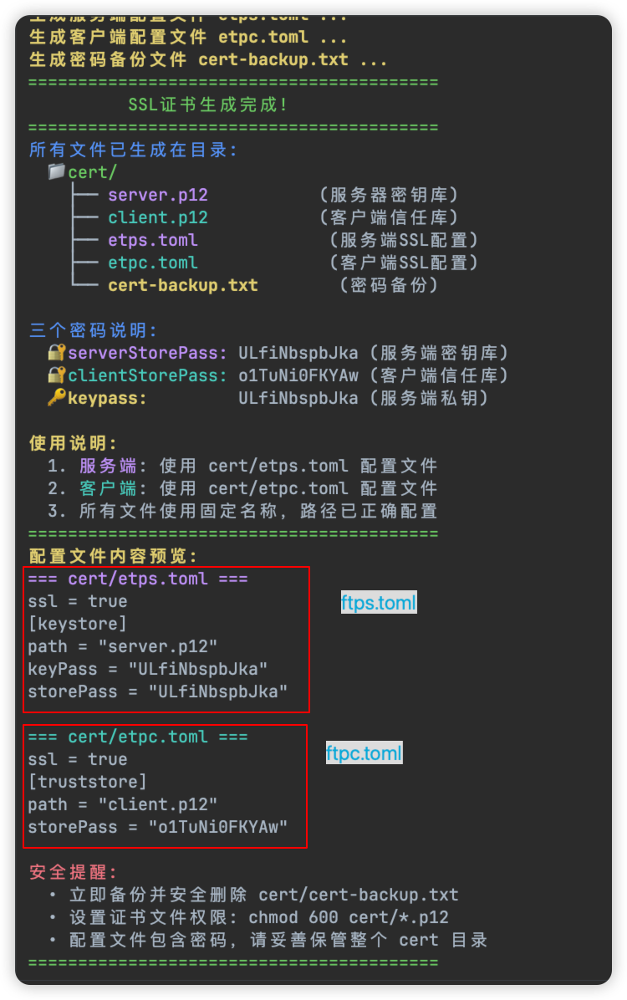

# TLS加密传输
etp强制采用`TLSv1.3`协议

## 密钥生成
- 下载密钥生成工具: [keytool](https://github.com/xiaoniucode/etp/tree/main/scripts/keytool)
- 下载命令行脚本：[generate_ssl_cert.sh](https://github.com/xiaoniucode/etp/tree/main/scripts/generate_ssl_cert.sh)

将上面下载的两个文件都放在同一个文件夹，然后运行脚本文件快速生成密钥配置
```js
./generate_ssl_cert.sh 
```
下面是自动生成的配置，如果需要自定义，请参考[文档](https://github.com/xiaoniucode/etp/blob/main/doc/code-gen.md)


输入y以后会自动生成服务端和客户端的密钥和证书


对应的密钥配置和证书也会在当前目录下生成。


## ✍️配置

### 🖥️服务端
```js
bindPort = 9527

ssl = true
[keystore]
path = "/path/cert/server.p12"
keyPass = "your-keypass"
storePass = "your-storepass"
    
[[clients]]
name = "macos"
secretKey = "your-secret-key"
   
[[clients.proxies]]
name = "MySQL"
type = "tcp"
localPort = 3306
remotePort = 3307

[[clients.proxies]]
name = "Redis"
type = "tcp"
localPort = 6379
remotePort = 6380 
```
### 💻客户端
```js
serverAddr = "x.x.x.x"
serverPort = 9527
secretKey = "your-secret-key"

ssl = true
[truststore]
path = "/path/cert/client.p12"
storePass = "your-storepass"
```
⚠️ `ssl=true / ssl=false`必须在服务端和客户端同时设置并保持一致！
