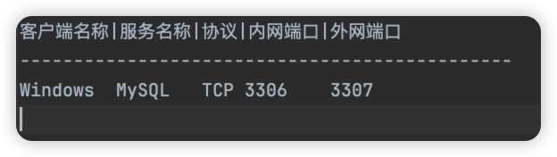

## 介绍

`etp`支持两种使用方式，支持纯`Toml`静态配置，也可以采用`图形化界面`实现动态配置端口映射规则，下面介绍如何通过`Toml`静态配置将内网的`MySQL`服务暴露到公网。

### 🖥️服务端

编辑`etps.toml`配置文件，添加如下配置

```toml
#host="0.0.0.0" #默认0.0.0.0
#bindPort = 9527 #默认9527

[[clients]]
name = "Windows" #自定义客户端名
secretKey = "Your-secret-key" #自定义认证密钥
    
[[clients.proxies]]
name = "mysql" #自定义映射名字
type = "tcp" #协议
localPort = 3306 #内网端口，这里演示代理MySQL端口
#remotePort = 3307 #自定义公网端口，不指定系统会自动分配
#status=1 #开启状态，默认开启，设置为0可关闭
```
- type : 协议的类型：目前只有`TCP`

命令行启动`./etps`后会在当前路径下生成`ports.txt`的文件，包含所有端口映射信息，如下：



### 💻客户端

```toml
serverAddr = "x.x.x.x" #etps所在服务器的地址，不指定默认为：127.0.0.1
serverPort = 9527 #etps配置的bindPort端口，默认为：9527
secretKey = "Your-secret-key" #认证密钥，和服务端保持一致
```

启动`./etpc`客户端后，用`serverAddr`地址和`3307`端口去连接`MySQL`。


